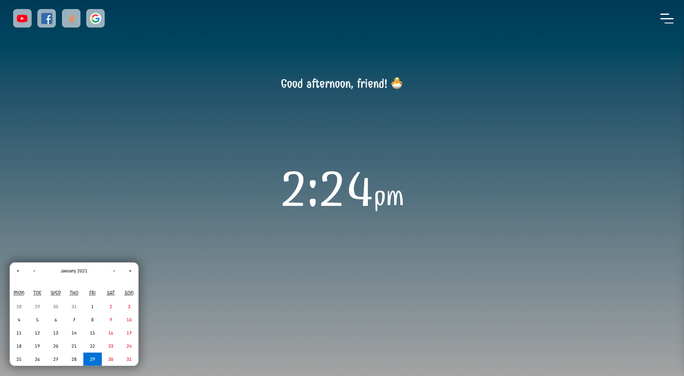
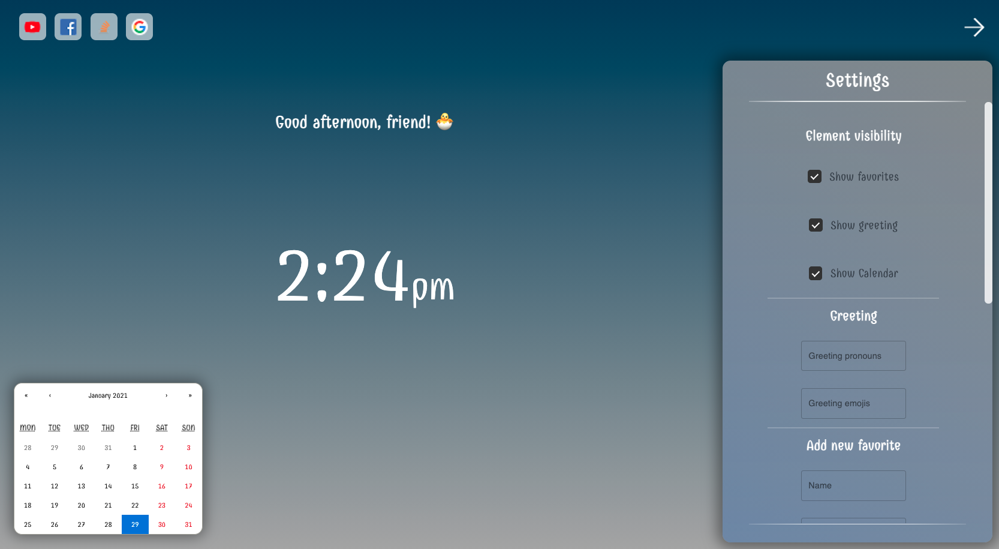
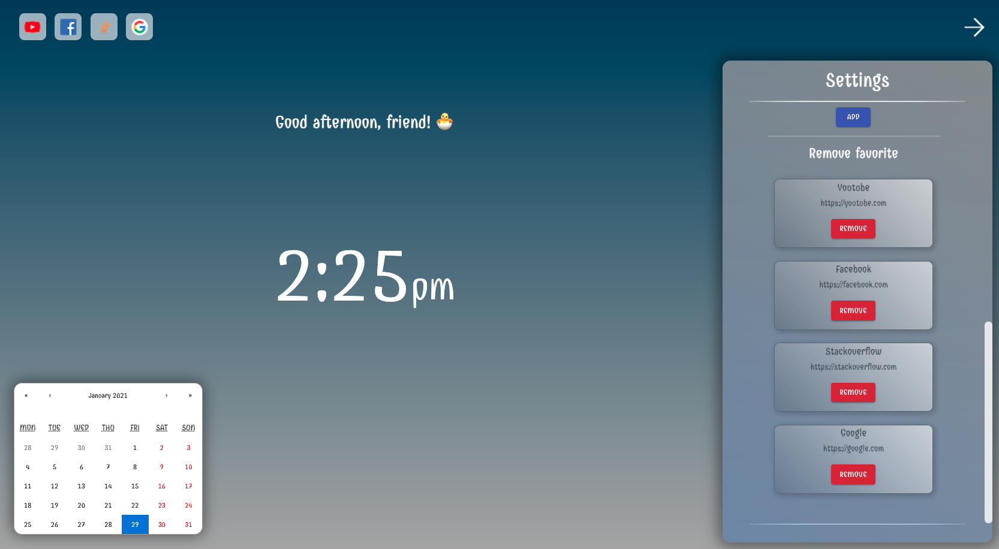

# React HomePage

> About a half year ago I made a homepage for myself into my browser when I used jquery to make it. But since then I learned a lot and now I am mainly using react so I decided to remake it.

## Some sample photos about it:

### First Sample

### Second Sample

### Third Sample

## To Do:

* [x] Change the favorites order by drag-and-drop
* [ ] Background color changing
* [ ] Background Image change?
* [ ] Should I store datas locally? Or should I write a server side for it?

## Links:

* burger:
   * https://www.npmjs.com/package/@animated-burgers/burger-squeeze
   * https://march08.github.io/animated-burgers/

* calendar component: https://www.npmjs.com/package/react-calendar

* checkbox component: https://www.npmjs.com/package/react-checkbox-component

* favorite order changing by drag-and-drop:
   * https://www.npmjs.com/package/react-dropzone
   * https://blog.logrocket.com/react-drag-and-drop/
   * https://www.youtube.com/watch?v=Vqa9NMzF3wc&ab_channel=LogRocket
   * https://codesandbox.io/s/k260nyxq9v?file=/index.js
   * https://github.com/atlassian/react-beautiful-dnd/issues/128
   * https://github.com/DucktorDanny/react-beautiful-dnd-example

* store locally the favorites and settings: https://www.code-boost.com/react-local-storage/