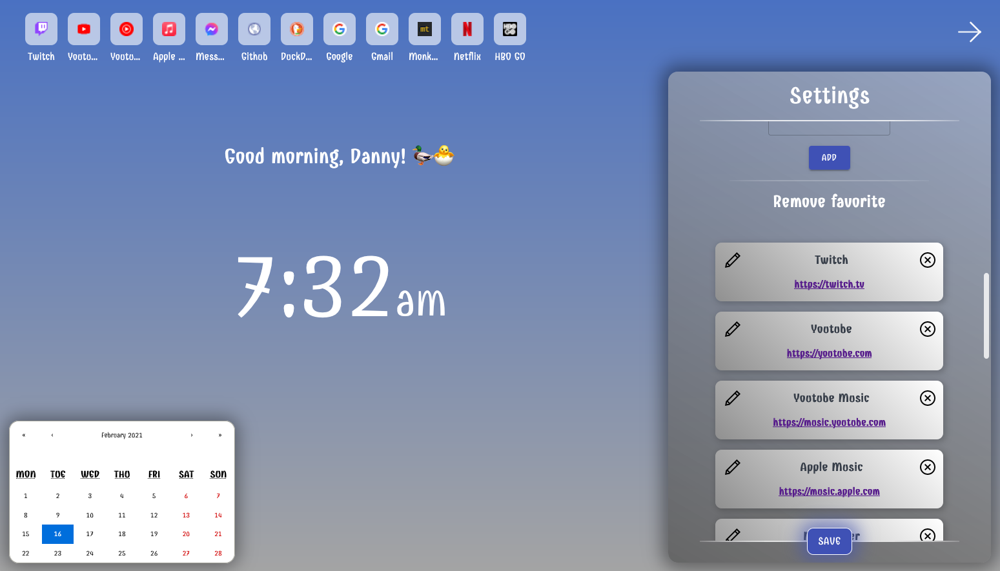
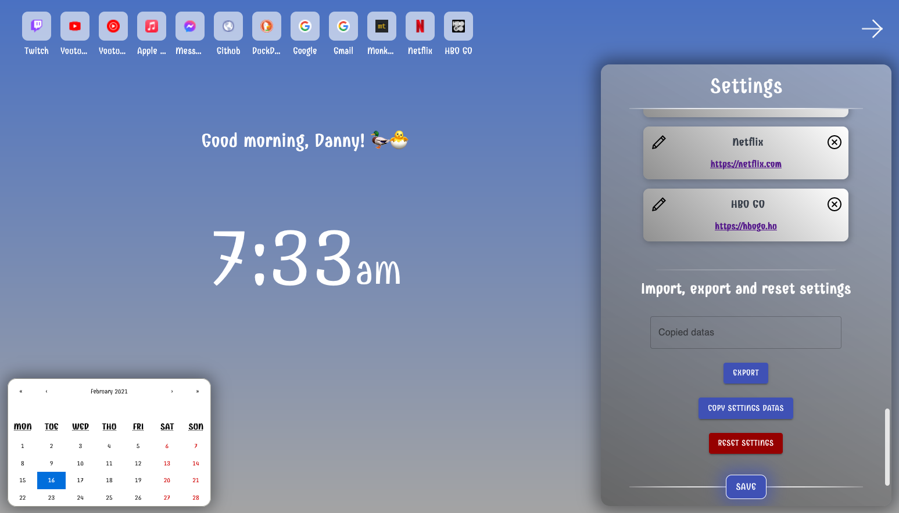
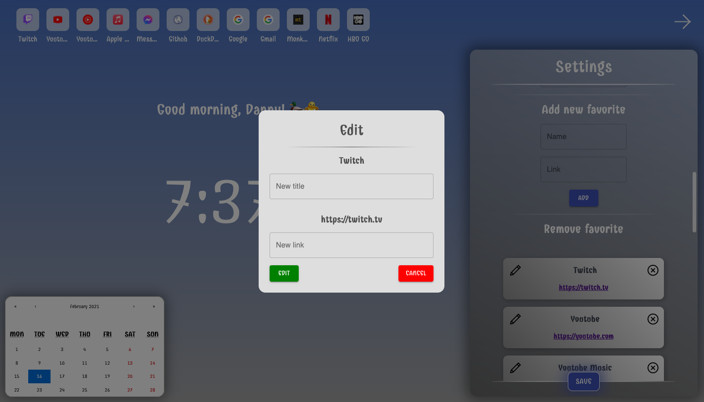

# React HomePage

> About a half year ago I made a homepage for myself into my browser when I used jquery to make it. But since then I learned a lot and now I am mainly using react so I decided to remake it. And now I learned about browser extension a lot so I am gonna use it as well.

## Some sample photos about it:

### Main


### Settings 1


### Settings 2


### Settings 3



### Settings 4



### Favorite edit popup



## To Do:

* [x] Change the favorites order by drag-and-drop
* [x] Fix Safari style issuescd 
* [x] Background color changing ( changing the top of linear graditent  RGB with sliders )
* [x] Settings open always at the top of the form
* [x] Set up local storage
   * [x] Get datas
   * [ ] ~~Make a function what returns the colors of a backgroundImage~~
   * [x] Convert backgroundImage string to an array with R, G and B
   * [x] Pass datas to localStorage
* [x] Feedback notification after save
* [x] A bit smaller favicon
* [x] Fix favorite icon name
* [x] Pronouns and emoji disappear on submit
* [x] ~~Greeting pronouns and emojis settings fix~~
* [x] Fixed clock animation
* [x] ~~Fix responsivibilty on Settings (and Firefox compatibleity [backdrop-filter])~~
* [x] Also publish it into chrome (Firefox submition done. Should I publish it for others too?) -> published on chrome for testers
* [x] Make popup component to the settings reset button.
   * Check reactjs-popup (https://react-popup.elazizi.com/component-api/)
* [x] Editable favorites popup
   * [x] Popup style for it
   * [x] Make the changes (immedietly saved locally too)
* [x] Update sample photos
* [x] ~~Settings scroll in Chrome and Firefox...~~
* [ ] ~~Add my logo what brings to the marketing side or whatever~~
* [x] Marketing side...?
   * [x] Figma design making for a pattern
   * [x] A full user guide
   * https://ducktor-homepage.vercel.app/
* [x] Settings component clean up
   * [x] Change greeting settings' method
   * [x] Chrome scrollbar width problem
   * [x] Warning for adding nothing to favorites
* [ ] Calendar events
   * [x] By clicking on a date popup calendar events 'settings'
   * [ ] Menupoint like 'All' and 'Selected' or 'Chosen'
   * [ ] Show all events button (maybe above the calendar)
   * [ ] Create, remove and edit events
   * [ ] If there is any event today show it on the right side
* [ ] After exporting make the changes instead of a simple reload
* [ ] Browser popup
   * [ ] Add the actual page to favorites
   * [ ] Make new event
* [ ] Update marketing_side on version update
* [ ] Close popup when user click out of it?

* Other ideas:
   * [ ] Slidable/scrollable favorite list (right-letf)
   * [ ] Background Image change?
   * [ ] Adding the actual site to favorites by popup.
   * [ ] Access to history

## Links:

* burger:
   * https://www.npmjs.com/package/@animated-burgers/burger-squeeze
   * https://march08.github.io/animated-burgers/

* calendar component:
   * https://www.npmjs.com/package/react-calendar

* checkbox component:
   * https://www.npmjs.com/package/react-checkbox-component

* favorite order changing by drag-and-drop:
   * https://www.npmjs.com/package/react-dropzone
   * https://blog.logrocket.com/react-drag-and-drop/
   * https://www.youtube.com/watch?v=Vqa9NMzF3wc&ab_channel=LogRocket
   * https://codesandbox.io/s/k260nyxq9v?file=/index.js
   * https://github.com/atlassian/react-beautiful-dnd/issues/128
   * https://github.com/DucktorDanny/react-beautiful-dnd-example

* textfield:
   * https://material-ui.com/components/text-fields/#textfield

* button:
   * https://material-ui.com/components/buttons/#button

* slider component:
   * https://material-ui.com/components/slider/

* store locally the favorites and settings:
   * https://www.code-boost.com/react-local-storage/

* React Notifications Component:
   * https://teodosii.github.io/react-notifications-component/
   * https://www.digitalocean.com/community/tutorials/react-react-notifications-component

* override homepage:
   * https://forums.opera.com/topic/20490/using-chrome_url_overrides-for-extension/4


## Local Storage Structure:

JSON:
```json
{
   "showElements": {
      "calendar": true,
      "favorites": true,
      "greeting": true,
   },
   "greeting": {
      "pronouns": "friend",
      "emoji": "🦆",
   },
   "favoritesArray": [
      {
         "name": "Youtube",
         "url": "https://youtube.com",
      },
      {
         "name": "Facebook",
         "url": "https://facebook.com",
      },
   ],
   "backgroundColor": {
      "R": 7,
      "G": 55,
      "B": 89,
   }
}
```

JavaScript Object:
```js
const data = {
   showElements: {
      calendar: true,
      favorites: true,
      greeting: true,
   },
   greeting: {
      pronouns: 'friend',
      emoji: '🦆',
   },
   favoritesArray: [
      {
         name: 'Youtube',
         url: 'https://youtube.com',
      },
      {
         name: 'Facebook',
         url: 'https://facebook.com'
      },
   ],
   backgroundColor: {
      R: 7,
      G: 55,
      B: 89,
   }
}
```