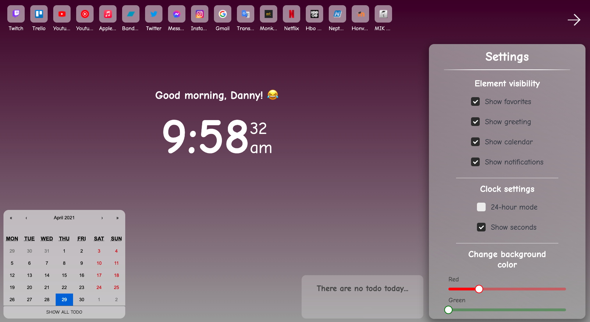

# React HomePage

> About a half year ago I made a homepage for myself into my browser when I used jquery to make it. But since then I learned a lot and now I am mainly using react so I decided to remake it. And now I learned about browser extension a lot so I am gonna use it as well.

## Samples, description and usage:

https://ducktor-homepage.vercel.app

### Positioning Plans


### Current Look Sample


## To Do:

* I moved my 'To Do' to trello.com

## Links:

* burger:
   * https://www.npmjs.com/package/@animated-burgers/burger-squeeze
   * https://march08.github.io/animated-burgers/

* calendar component:
   * https://www.npmjs.com/package/react-calendar

* checkbox component:
   * https://www.npmjs.com/package/react-checkbox-component

* favorite order changing by drag-and-drop:
   * https://www.npmjs.com/package/react-dropzone
   * https://blog.logrocket.com/react-drag-and-drop/
   * https://www.youtube.com/watch?v=Vqa9NMzF3wc&ab_channel=LogRocket
   * https://codesandbox.io/s/k260nyxq9v?file=/index.js
   * https://github.com/atlassian/react-beautiful-dnd/issues/128
   * https://github.com/DucktorDanny/react-beautiful-dnd-example

* textfield:
   * https://material-ui.com/components/text-fields/#textfield

* button:
   * https://material-ui.com/components/buttons/#button

* slider component:
   * https://material-ui.com/components/slider/

* store locally the favorites and settings:
   * https://www.code-boost.com/react-local-storage/

* React Notifications Component:
   * https://teodosii.github.io/react-notifications-component/
   * https://www.digitalocean.com/community/tutorials/react-react-notifications-component

* override homepage:
   * https://forums.opera.com/topic/20490/using-chrome_url_overrides-for-extension/4

* Used icons:
   * Close icon 1: https://iconmonstr.com/x-mark-8-svg/
   * Close icon 2: https://iconmonstr.com/x-mark-11-svg/
   * Edit icon: https://iconmonstr.com/pencil-15-svg/
   * Show all favorites in Settings: https://iconmonstr.com/arrow-65-svg/

* Marketing Side Image Viewer:
   * react-image-gallery: https://www.npmjs.com/package/react-image-magnify

* For later:
   * for overflow margin-right problem: https://stackoverflow.com/questions/11695354/css-right-margin-does-not-work-inside-a-div-with-overflow-scroll

## Local Storage Structure:

### Datas

JSON:
```json
{
   "showElements": {
      "calendar": true,
      "favorites": true,
      "greeting": true,
   },
   "greeting": {
      "pronouns": "friend",
      "emoji": "🦆",
   },
   "favoritesArray": [
      {
         "name": "Youtube",
         "url": "https://youtube.com",
      },
      {
         "name": "Facebook",
         "url": "https://facebook.com",
      },
   ],
   "backgroundColor": {
      "R": 7,
      "G": 55,
      "B": 89,
   }
}
```

JavaScript Object:
```js
const data = {
   showElements: {
      calendar: true,
      favorites: true,
      greeting: true,
   },
   greeting: {
      pronouns: 'friend',
      emoji: '🦆',
   },
   favoritesArray: [
      {
         name: 'Youtube',
         url: 'https://youtube.com',
      },
      {
         name: 'Facebook',
         url: 'https://facebook.com'
      },
   ],
   backgroundColor: {
      R: 7,
      G: 55,
      B: 89,
   }
}
```

### Events

Date.getTime() is the key and all event has a title and a content

```js
{
   "1616713200000": [
      {
         "title": "Something",
         "content": "This is also something what you could write here."
      }
   ],
   "1631570400000": [
      {
         "title": "Something 2",
         "content": "alskd jas daskl jdlask djaslk jd"
      }
   ],
   "1616799600000": [
      {
         "title": "Asd",
         "content": "ADASD jasl djasl djals jdlasd"
      },
      {
         "title": "Nothing",
         "content": "ajd lsaj dlasjk dlajs dlk"
      }
   ],
   "1616886000000": [
      {
         "title": "This is a new day",
         "content": "This is another test event for the next day. Let's see how well it works."
      }
   ]
}
```